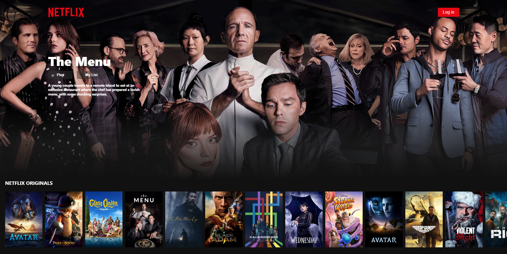

# :tv: Netflix

show search engine that showcases information related to different television series.

✅ Users can search TV shows & movies using the search bar..  
✅ Users can explore different TV shows and filter them by genre: drama, comedy, crime, action, etc.  
✅ Users can access information related to a specific TV show including plot, ratings, cast list, trailer, and more.  
✅ uthenticated users can add or delete TV shows & movies from their personal watchlist.
✅ The app is fully responsive and it adapts to any screen size. 

 
:link: Link to the live project: [Link](https://netflix-is.web.app/#/)  
 

 

## My Process

I developed the project over the course of approximately A week and a half. In order to learn as much as I can from the development of this project, I implemented certain features from scratch including accessible and scrollable tabs, a carousel functionality, and infinite loading.

### Tools

After designing a prototype of the application using Adobe XD, I started developing the app using the following technologies:

- angular. 
- typescript.
- rxjs
- SCSS modules (CSS grid & CSS Flexbox & Media queries)
- Firebase authentication services & Firestore database

In order to search and obtain information about TV shows, I used the TMDB API and the OMDB API.
